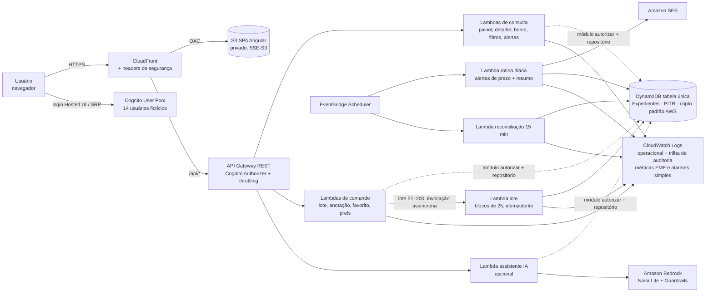
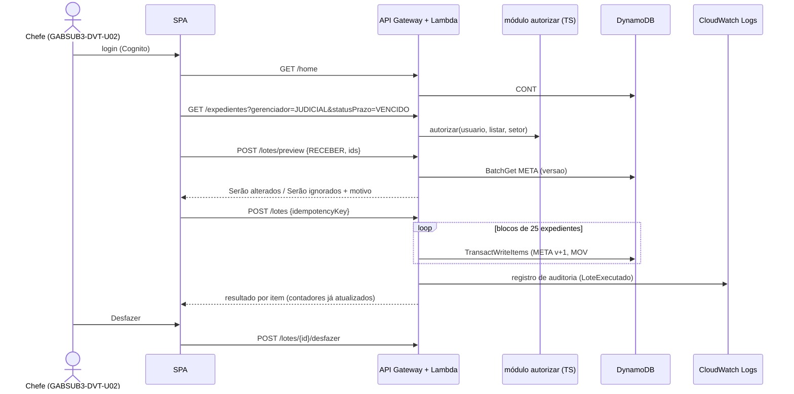
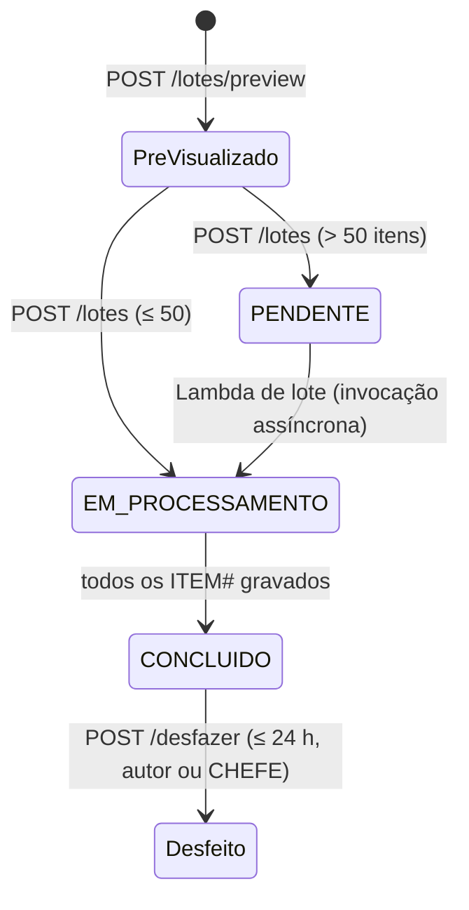

# Documento de Design — Painel Unificado de Expedientes e Nova Tela Inicial

> Spec Kiro · Hackathon AWS × MPF · 07/10/2026 · Fase 2 (Design)
> Base: `requirements.md` (Requisitos 1–36) · Idioma: português do Brasil · Região: `us-east-1`

## 1. Visão geral

A solução é uma SPA servida por CloudFront que consome uma API REST serverless (API Gateway + Lambda) sobre a tabela
única DynamoDB carregada **diretamente** do seed existente (`seed/saida/dynamodb/itens.json`). Toda escrita atualiza,
na mesma `TransactWriteItems`, os contadores `CONT#`, a versão do índice de busca do setor e as notificações; a
trilha de auditoria vai para um grupo dedicado do CloudWatch Logs. A autorização por setor e sigilo é decidida no
backend por um módulo/middleware TypeScript (PDP). O EventBridge Scheduler dispara a rotina diária (alertas + resumo
por SES) e a reconciliação. O Amazon Bedrock (opcional) gera o "Resumo do dia" e converte pesquisa em linguagem
natural em filtros validados. A stack segue o steering `tech.md`.

Princípios:

- **Seed é a fonte de verdade de dados:** nada em `resources/` é editado. A aplicação só acrescenta itens pela migração
  (Req. 2).
- **MVP demonstrável cedo:** o caminho essencial (login → tela inicial → painel → detalhe → lote) usa só leitura direta
  do DynamoDB, sem filas nem barramento intermediário (Req. 29).
- **Handlers enxutos, sem framework de servidor:** uma responsabilidade por Lambda, sem Express/Nest (evita *cold
  start*). Regras de domínio puras (prazo, prioridade, risco, elegibilidade/validação de lote, máscara, autorização)
  num pacote sem dependência de AWS; acesso a dados só pela camada de repositório (Req. 29.4, 29.5, 29.12, 36.3).

### 1.1 Stack (conforme `tech.md`)

| Camada | Escolha | Motivo | Requisitos |
| --- | --- | --- | --- |
| Linguagem/runtime | TypeScript em backend, IaC e frontend; Node.js 24 (`nodejs24.x` na Lambda, `.nvmrc` com `24`) | Uma linguagem só; tipos compartilhados entre API e SPA | 29.4, 29.12, 36.3 |
| Frontend | Angular 22 (standalone components, Signals) + Bootstrap 5 no padrão visual do Único | Mesmo framework e visual do Único, facilita reuso | 27, 28, 36.2 |
| Backend | Lambdas por rota atrás do API Gateway, sem framework de servidor | Cold start baixo, IAM por função | 29.4 |
| Dados | DynamoDB tabela única (`PK`/`SK`, `GSI1`, `GSI2`) do `itens.json` | Reuso do seed | 2, 29.5 |
| IaC | AWS CDK v2 (`aws-cdk-lib` 2.x, TypeScript), um `App` com stacks separadas | Deploy/destroy por comando, parâmetros por ambiente | 29.11, 36.4 |
| Testes | `npm test` (Vitest + fast-check no domínio/API); `ng test` no front (runner padrão do Angular 22); Playwright + axe-core **opcional** | Unitário, propriedade e paridade num comando | 33 |
| Carga do seed | `AWS_PROFILE=hackatongabinete python3 resources/hackathon-expedientes/seed/gerar_seed.py --carregar --criar-tabela --tabela Expedientes --regiao us-east-1` | Comando oficial do `tech.md` | 2 |

> O Angular CDK não é usado: Bootstrap 5 + `<dialog>` nativo cobrem modal e foco; a reordenação usa *drag and drop*
> nativo do HTML com botões "Mover para cima/baixo" acessíveis por teclado (Req. 7.1, 21.1).

## 2. Arquitetura AWS

Atende: Req. 1, 4, 5, 17, 18, 22, 24, 25, 29, 30, 31, 32.



O índice de busca do setor vive na memória da Lambda de consulta e é montado por `Query` no `GSI1` (seção 3.4). Não há
filas, barramento, Streams nem bucket de índice no MVP.

### 2.1 Stacks CDK

| Stack | Recursos | Requisitos |
| --- | --- | --- |
| `DadosStack` | Tabela `Expedientes` (PK/SK, GSI1, GSI2, on-demand, PITR, TTL `expiraEm`, criptografia padrão gerenciada pela AWS) | 2, 5, 25, 29 |
| `AuthStack` | Cognito User Pool (atributos `custom:idUsuario`, `custom:siglaSetor`, `custom:perfil` somente leitura), App Client SPA (PKCE) | 1, 24 |
| `ApiStack` | API Gateway REST, authorizer Cognito, Lambdas `nodejs24.x` arm64 (uma role IAM por função), Lambda de lote com invocação assíncrona, validação de esquema, throttling, CORS restrito, Guardrail e permissão `bedrock:InvokeModel` só para o modelo escolhido (opcional, por parâmetro) | 14, 22, 24, 25, 29 |
| `AgendamentosStack` | EventBridge Scheduler (rotina diária 07:00 e reconciliação 15 min), Lambdas agendadas, identidade SES | 4, 17, 18, 29 |
| `WebStack` | Bucket SPA (SSE-S3, Block Public Access), CloudFront (OAC, TLS 1.2, response headers policy) | 25, 28, 29 |
| `ObservabilidadeStack` | Grupos do CloudWatch Logs (retenção 30 dias, incluindo `/painel-expedientes/auditoria`), dashboard e alarmes simples (5xx > 1 %, p95, erros de Lambda, throttling) | 25.9, 30 |

Todos os recursos recebem as tags `projeto=painel-expedientes` e `ambiente=<env>` (Req. 32.3). Comandos:
`npx cdk deploy --all --profile hackatongabinete` e `npx cdk destroy --all --profile hackatongabinete` (Req. 26.7).

### 2.2 Fluxo principal da demo



## 3. Modelo de dados DynamoDB

Atende: Req. 2, 3, 4, 5, 6, 13, 14, 15, 17, 19, 20, 21, 29, 31.

Tabela única **`Expedientes`**, chaves `PK`/`SK` (String), `GSI1` (`GSI1PK`/`GSI1SK`) e `GSI2` (`GSI2PK`/`GSI2SK`),
projeção ALL — exatamente o formato de `itens.json`. O atributo `entidade` guarda o nome do CSV de origem.

### 3.1 Entidades do seed (conferidas em `itens.json`)

| `entidade` (CSV) | PK | SK | GSI1 | GSI2 |
| --- | --- | --- | --- | --- |
| `setores` | `SETOR#<sigla>` | `PERFIL` | — | — |
| `usuarios` | `USR#<idUsuario>` | `PERFIL` | `SETOR#<sigla>` / `USR#<idUsuario>` | — |
| `expedientes` | `EXP#<idExpediente>` | `META` | `SETOR#<sigla>` / `ATIVO#<JUD\|DOC\|EXT>#<caixa>#<dataChegada>#<id>` (baixados: `HIST#…`) | `SETOR#<sigla>` / `PRAZO#<dataPrazo>#<100-pontuação, 3 dígitos>#<id>` |
| `movimentacoes` | `EXP#<id>` | `MOV#<dataHora>#<idMovimentacao>` | — | — |
| `prazos` | `EXP#<id>` | `PRZ#<idPrazo>` | — | — |
| `designacoes` | `EXP#<id>` | `DES#<idDesignacao>` | `USR#<idUsuarioDesignado>` / `DES#<situacao>#<prazoDevolucao>#<id>` | — |
| `anotacoes` | `EXP#<id>` | `ANO#<dataHora>#<idAnotacao>` | — | — |
| `marcadores` | `SETOR#<sigla>` | `ROT#<gerenciador>#<idRotulo>` | — | — |
| `marcadores_expedientes` | `EXP#<id>` | `ROT#<idRotulo>` | `ROT#<idRotulo>` / `<dataInclusao>#<id>` | — |
| `favoritos` | `SETOR#<sigla>` | `FAV#<gerenciador>#<id>` | — | — |
| `notificacoes` | `USR#<id>` | `NOT#<dataHora>#<idNotificacao>` | — | — |
| `acoes_lote` | `USR#<id>` | `LOTE#<dataHora>#<idLote>` | `SETOR#<sigla>` / `LOTE#<dataHora>#<idLote>` | — |
| `preferencias_usuario` | `USR#<id>` | `PREF#<contexto>` | — | — |
| `filtros_salvos` | `USR#<id>` | `FILTRO#<idFiltro>` | — | — |
| `contadores` | `SETOR#<sigla>` | `CONT#<gerenciador>` (inclui `CONT#TODOS`) | — | — |
| `estoque_diario` | `SETOR#<sigla>` | `EST#<gerenciador>#<data>` | — | — |
| `produtividade_diaria` | `SETOR#<sigla>` | `PROD#<data>#<gerenciador>#<idUsuario>` | `USR#<id>` / `PROD#<data>#<gerenciador>` | — |
| `noticias` | `NOTICIA` | `<ordem>#<dataInicioExibicao>#<idNoticia>` | — | — |
| `catalogos` | `CATALOGO#<dominio>` | `<ordem 3 dígitos>#<codigo>` | — | — |

### 3.2 Itens acrescentados pela aplicação

| Item | PK | SK | Origem | Requisitos |
| --- | --- | --- | --- | --- |
| Favorito por usuário (30, migração) | `USR#<idUsuario>` | `FAV#<gerenciador>#<id>` | `favoritos.csv` | 2.4, 13.7 |
| Espelho de filtro compartilhado (9, migração) | `SETOR#<sigla>` | `FILTRO#<idFiltro>` | `filtros_salvos.csv` | 2.4, 6 |
| Catálogo `CIENCIA`, `REVERSAO_LOTE`, `DESFAZER`, `STATUS_EXECUCAO_LOTE` (6, migração) | `CATALOGO#…` | `0nn#<codigo>` | Migração | 2.4 |
| Atributo `versao = 1` em todo `META` | `EXP#<id>` | `META` | Migração | 2.4, 15 |
| Resultado por item do lote | `LOTE#<idLote>` | `ITEM#<id>` | Execução | 14.5 |
| Estado anterior (before-image), TTL 7 dias | `LOTE#<idLote>` | `ANTES#<id>` | Execução | 15.6 |
| Cabeçalho/status do lote assíncrono | `LOTE#<idLote>` | `STATUS` | Execução | 29.7 |
| Idempotência de comando | `IDEMP#<chave>` | `IDEMP` (TTL 24 h) | API | 14.3 |
| Versão do índice de busca (`ADD versao 1` na transação de toda escrita) | `SETOR#<sigla>` | `INDICE#BUSCA` (`versao`) | Escrita | 5.10, 29.3 |
| Leiaute da tela inicial | `USR#<id>` | `PREF#TELA_INICIAL` | Usuário | 21.2 |
| Contador de uso de IA (TTL 1 h) | `USR#<id>` | `IA#<hora>` | Assistente | 22.8 |

Resultado esperado após migração: **49.153 itens** (Req. 2.5). O script de migração é idempotente (`PutItem` com
`attribute_not_exists(PK)`; `UpdateItem` com `if_not_exists(versao)`).

### 3.3 Padrões de acesso

| # | Acesso | Operação | Requisitos |
| --- | --- | --- | --- |
| A1 | Perfil do usuário | `GetItem USR#<id>/PERFIL` | 1 |
| A2 | Contadores da tela inicial e caixas | `Query PK=SETOR#<sigla>, begins_with(SK,"CONT#")` | 4, 20 |
| A3 | Painel por caixa/gerenciador | `Query GSI1 SETOR#<sigla>, begins_with(GSI1SK,"ATIVO#<ger>#<caixa>")` | 3, 4 |
| A4 | Histórico (baixados) | `Query GSI1 begins_with(GSI1SK,"HIST#")` | 4.4, 19 |
| A5 | Fila / próximos prazos / modo foco | `Query GSI2 SETOR#<sigla>` ascendente, filtro `requerAcao` | 8, 11, 20.3 |
| A6 | Detalhe completo | `Query PK=EXP#<id>` (META, MOV#, PRZ#, DES#, ANO#, ROT#) | 13 |
| A7 | Designados para mim | `Query GSI1 USR#<id>, begins_with(GSI1SK,"DES#ATIVA#")` | 5.3, 16 |
| A8 | Alertas | `Query PK=USR#<id>, begins_with(SK,"NOT#")` descendente | 17, 20.4 |
| A9 | Preferências, filtros, favoritos | `Query PK=USR#<id>, begins_with(SK,"PREF#"/"FILTRO#"/"FAV#")` | 6, 7, 13 |
| A10 | Filtros compartilhados do setor | `Query PK=SETOR#<sigla>, begins_with(SK,"FILTRO#")` | 6 |
| A11 | Trilha de lotes do setor | `Query GSI1 SETOR#<sigla>, begins_with(GSI1SK,"LOTE#")` | 15.11 |
| A12 | Estoque / produtividade | `Query PK=SETOR#<sigla>, begins_with(SK,"EST#"/"PROD#")`; individual via GSI1 `USR#` | 16, 19 |
| A13 | Informes, catálogos | `Query PK=NOTICIA`; `Query PK=CATALOGO#<dominio>` | 20.6, 36.2 |
| A14 | Pesquisa/filtros livres | Índice de busca do setor em memória da Lambda (montado por A3) | 5, 31 |

Nenhum acesso usa `Scan` (Req. 31.3).

### 3.4 Índice de busca do setor

Atende: Req. 5.9–5.13, 31. Decisão D19.

- **Formato:** estrutura em memória da Lambda de pesquisa, uma entrada por expediente ativo com os campos filtráveis,
  `versao` e `textoBusca` normalizado (NFD sem diacríticos, minúsculas). Sigilosos não têm `assunto`, `resumo` nem
  `tema` no `textoBusca` (Req. 5.9). Sem bucket nem serviço de busca dedicado.
- **Leitura:** a cada requisição a Lambda lê `SETOR#<sigla>/INDICE#BUSCA` (1 `GetItem`); se a versão mudou, remonta o
  índice por `Query GSI1 SETOR#<sigla>, begins_with(GSI1SK,"ATIVO#")` paginada (projeção só dos campos filtráveis).
  ~3.500 itens × ~600 B ≈ 2 MB: cabe com folga em 1 GB de memória mesmo com 10× (Req. 31.5).
- **Escrita:** toda transação de negócio faz `ADD versao 1` em `INDICE#BUSCA` do setor; não há consumidor assíncrono.
  Como a remontagem lê o próprio GSI1, o índice converge na próxima leitura (≪ 5 s, Req. 4.6).
- **Paginação:** cursor opaco Base64 `{versaoIndice, ultimaChave, idExpediente}`; total exato calculado em memória.
- **Trade-off:** OpenSearch Serverless descartado pelo custo mínimo contínuo (Req. 32.4).

## 4. Componentes e APIs

### 4.1 Pacotes do repositório

```
app/
├── .nvmrc                  # 24 (alinhado ao runtime nodejs24.x)
├── packages/dominio/       # regras puras: prazo, prioridade, risco, elegibilidade/validação de lote, máscara,
│                           # critérios, CSV e autorização (matriz do Req. 24.3 como dados)
├── packages/contratos/     # tipos e esquemas JSON (OpenAPI) compartilhados
├── services/api/           # handlers Lambda enxutos por rota (sem Express/Nest) + repositorio/ (DynamoDB) + Bedrock
├── services/agendados/     # rotina diária (alertas + SES), reconciliação
├── web/                    # SPA Angular 22 + Bootstrap 5
├── infra/                  # app CDK v2
├── scripts/                # carga do seed, migração, restauração, gerador 10×
└── tests/                  # carga (k6/artillery); e2e Playwright opcional
```

Atende: Req. 29.12, 33.6, 34.4, 36.3.

### 4.2 Módulo de domínio (`packages/dominio`)

| Função | Regra | Requisitos |
| --- | --- | --- |
| `calcularStatusPrazo(diasRestantes, caixa, dataEncerramento?)` | RN1 nos ativos; `CUMPRIDO`/`CUMPRIDO_COM_ATRASO` nos baixados | 9, 33.2 |
| `calcularPontuacao(exp)` → `{total, faixa, composicao[]}` | RN2, divisão inteira em `ENVIADO_NAO_RECEBIDO`, 0 nos baixados | 8, 33 |
| `calcularRisco(tempoParadoDias, diasRestantes)` | `min(100, 20×(p+1)÷(d+1))`, faixas D3 | 10 |
| `chaveGsi1/chaveGsi2(exp)` | Mesmo formato do gerador | 2.7 |
| `avaliarElegibilidade(acao, exp, params)` | Tabela do Req. 14.2 (RN4, RN5) | 14, 15 |
| `aplicarEfeito(acao, exp)` → `{depois, itensRelacionados, antes}` | Efeitos simulados e before-image | 14, 15 |
| `mascararSigilo(exp, usuario)` | Campos D1 → "Conteúdo sigiloso" | 24.6–24.7 |
| `validarCriterios(json)` | Lista branca de campos/valores do Req. 5 | 5.8, 22.3 |
| `neutralizarCsv(valor)` | Prefixo `'` para `= + - @ \t \r` | 23.3 |
| `sugerirDesignacao(pessoas, itens)` | Carga ÷ capacidade (D6) | 16 |
| `autorizar(usuario, acao, recurso)` → `{permitido, status: 403\|404, motivo}` | Matriz do Req. 24.3, negação por padrão | 24 |

O repositório (`services/api/repositorio/`) é a única camada que conhece `PK`/`SK`, `GSI1` e `GSI2`; expõe funções
como `listarAtivosDoSetor`, `obterDetalhe`, `gravarUnidadeAtomica` e usa só `ExpressionAttributeValues` (Req. 25.2,
29.5). Cada *handler* faz: validar entrada → `autorizar` → chamar domínio/repositório → `mascararSigilo` → responder.

### 4.3 API REST (`/api/v1`, JSON, OpenAPI em `packages/contratos`)

Todas as rotas exigem token Cognito (Req. 24.1) e passam pelo módulo `autorizar` (PDP). Setor, perfil e usuário vêm só das *claims*
(Req. 1.4).

| Método e rota | Função | Requisitos |
| --- | --- | --- |
| `GET /me` | Usuário, setor, perfil, data de referência | 1 |
| `GET /home` | Widgets agregados (contadores, 10 prazos, 5 alertas, próximo, informes, opcionais) | 20, 21 |
| `GET/PUT /home/layout` | Leiaute `PREF#TELA_INICIAL` | 21 |
| `GET /contadores?gerenciador=` | `CONT#…` | 4 |
| `GET /expedientes?visao&caixa&q&filtros&ordem&cursor&limite` | Painel via índice de busca | 3, 5, 8, 10 |
| `GET /expedientes/fila?cursor` | Modo foco (GSI2) | 11 |
| `GET /expedientes/{id}` | Detalhe + histórico (máscara) | 13 |
| `POST /expedientes/{id}/anotacoes` | Anotação + `ANOTACAO_INCLUIDA` | 13.6 |
| `PUT/DELETE /expedientes/{id}/favorito` | Favorito pessoal | 13.7–13.8 |
| `GET/POST/PUT/DELETE /filtros` | Filtros salvos e espelho compartilhado (transação) | 6 |
| `GET/PUT /preferencias/{contexto}` | Colunas, ordenação, densidade, tema | 7 |
| `POST /lotes/preview` | Pré-visualização sem efeito | 15.1–15.4 |
| `POST /lotes` (header `Idempotency-Key`) | Execução síncrona ≤ 50; 51–200 → 202 + invocação assíncrona da Lambda de lote | 14, 29.7 |
| `GET /lotes?escopo=meus\|setor`, `GET /lotes/{id}` | Trilha e status | 15.11, 29.7 |
| `POST /lotes/{id}/desfazer` | Reversão (409 após 24 h) | 15.5–15.10 |
| `GET /designacao/sugestoes` | Designação balanceada | 16 |
| `GET /alertas`, `PATCH /alertas` | Central de alertas, marcar lida/não lida | 17 |
| `GET /calendario?mes`, `GET /calendario.ics` | Calendário e iCal sem conteúdo sigiloso | 12 |
| `GET /indicadores?periodo&gerenciador` | Dashboards | 19 |
| `GET /exportacoes/{painel\|historico\|indicador}.csv` | CSV seguro (≤ 5.000 linhas) | 23 |
| `GET /resumo-diario/preview` | Pré-visualização do e-mail | 18.5 |
| `POST /ia/resumo-dia`, `POST /ia/interpretar-pesquisa` | Assistente Bedrock | 22 |

Erros padronizados `{codigo, mensagem, correlationId, campos?}`: 400 validação, 401 sem token, 403 operação negada no
próprio setor, 404 recurso inexistente ou de outro setor, 409 conflito de versão/janela do desfazer, 429 limite, 500
genérico sem *stack trace* (Req. 25.6).

### 4.4 Ações em lote

Atende: Req. 14, 15, 16, 29.7.



- A validação de lote (`avaliarElegibilidade`, limite de 200, permissões por item) é pura e roda antes de qualquer
  escrita. A execução segue em blocos de 25 expedientes com concorrência limitada; o status `LOTE#/STATUS` é
  atualizado a cada bloco.
- Cada item: `TransactWriteItems` com `ConditionExpression versao = :lida` no `META`, `Put MOV#`, `Put/Update DES#` ou
  `ROT#`, `Put LOTE#/ANTES#`, `Put LOTE#/ITEM#` (`attribute_not_exists` → retomada idempotente), `ADD` nos
  `CONT#<ger>`/`CONT#TODOS` afetados, `ADD versao` em `INDICE#BUSCA` e `Put NOT#` para o destinatário (designação).
  Conflito de transação nos contadores → retentativa com recuo exponencial (SDK).
- Falha de condição → `IGNORADO` "Alterado depois da pré-visualização" (Req. 15.4).
- Ao final, `Put` em `USR#<id>/LOTE#<dataHora>#<idLote>` com os campos de `acoes_lote.csv` e `GSI1PK=SETOR#<sigla>`.
- Desfazer: mesma mecânica, condicional a `versao = versaoDepois`; grava `REVERSAO_LOTE` e lote `tipoAcao=DESFAZER`.

### 4.5 Efeitos síncronos, auditoria e agendamentos

Atende: Req. 4.6, 17.5, 25.9, 29.3–29.10.

| Fato de domínio | Efeito na mesma transação | Registro de auditoria (CloudWatch Logs) |
| --- | --- | --- |
| `ExpedienteRecebido`, `ExpedienteDesignado`, `ExpedienteMovimentado`, `ExpedienteArquivado`, `CienciaRegistrada`, `AssinaturaRegistrada`, `MarcadorIncluido`, `AnotacaoIncluida` | `ADD CONT#`, `ADD versao INDICE#BUSCA`, `Put NOT#` ao destinatário | Sim |
| `FavoritoAlterado`, `FiltroAlterado` | `ADD` contador de favoritos / espelho do filtro | Sim |
| `LoteExecutado`, `LoteDesfeito` | `USR#/LOTE#`, `LOTE#/STATUS` | Sim + métrica |
| `AcessoNegado`, `ExportacaoGerada` | — | Sim |

Registro de auditoria: `eventId` (ULID), `tipo`, `idExpediente|idLote`, `versao`, `siglaSetor`, `idUsuario`, `perfil`,
`dataHora`, `resultado`, `motivo`, `correlationId` (sem campos sigilosos), gravado pelo módulo `auditar` no grupo
`/painel-expedientes/auditoria` depois da escrita confirmada. Idempotência: `IDEMP#<chave>` + `ITEM#` condicional; o
mesmo `eventId` não é registrado duas vezes. A reconciliação (Scheduler 15 min) recalcula `CONT#` por `Query GSI1` e
publica a métrica `DivergenciasCorrigidas`. A invocação assíncrona da Lambda de lote usa a retentativa nativa (2
tentativas); falha final fica no log com alarme de erros.

### 4.6 Frontend (SPA Angular)

Atende: Req. 1, 3–21, 27, 28.

| Tela / componente | Conteúdo | Requisitos |
| --- | --- | --- |
| Login | Cognito Hosted UI (PKCE) | 1 |
| Shell | Cabeçalho com usuário/setor/perfil, "Dados de 07/10/2026, 17:00", "Base 100% sintética", contador de alertas, skip link | 1.8, 17.4, 27.1 |
| Tela inicial | Grade de widgets, erro isolado por widget, configuração | 20, 21, 22.1 |
| Painel | Seletor de visão, abas de caixa com contador, barra de pesquisa (+ "Pesquisar com IA"), filtros, chips removíveis, tabela/cartões, seleção, barra de lote | 3–8, 10, 14, 22.2 |
| Selo de prazo / prioridade | Cor do catálogo + ícone + texto; tooltip com composição | 8, 9, 27.5 |
| Detalhe | Abas Resumo, Histórico (tabela acessível + filtro + CSV), Prazos, Designações, Anotações | 13 |
| Modo foco | Um item por vez, ação pendente, atalhos de teclado | 11 |
| Diálogo de lote | `<dialog>` modal com duas listas, confirmação, resultado com "Desfazer" | 15 |
| Calendário, Indicadores, Alertas | Gráficos com tabela alternativa | 12, 17, 19 |

Angular 22 com standalone components e Bootstrap 5 (CSS e utilitários de grid/espaçamento, tema do Único sobre
variáveis CSS do Bootstrap; JS do Bootstrap só onde necessário, sem jQuery). Estado com Angular Signals; URL reflete filtros (Req. 5.7); atualizações de contador por *polling* curto (10 s) com
valor otimista "atualizando…" (Req. 4.7); alertas novos por *polling* de 15 s (≤ 30 s, Req. 17.5). Tokens de cor do
catálogo com variantes de contraste verificadas para tema claro e escuro (Req. 27.6).

## 5. IA generativa com Amazon Bedrock

Atende: Req. 22, 24.7, 26.3, 30.3, 32. Decisão D9.

| Caso | Entrada ao modelo | Saída | Controles |
| --- | --- | --- | --- |
| Resumo do dia | Contadores + top 10 da fila: `etiqueta`, `dataPrazo`, `statusPrazo`, `prioridade`, motivos da composição (sem assunto de sigilosos, sem nomes) | Texto curto em pt-BR | Guardrail, selo "Gerado por IA — confira antes de agir", cache 15 min por setor |
| Pesquisa em linguagem natural | Frase do usuário + esquema dos campos/valores permitidos (catálogos) | JSON `criterios` (formato `filtros_salvos`) | Converse API com *tool use* / JSON schema, `validarCriterios`, confirmação antes de aplicar |

- Modelo: Amazon Nova Lite via perfil de inferência `us.amazon.nova-lite-v1:0` (baixo custo e latência); alternativa
  configurável Claude Haiku. Timeout de 5 s com *fallback* para filtros manuais (Req. 22.7).
- Bedrock Guardrails: filtros de conteúdo, *prompt attack* e PII (mascarar) na entrada e na saída (Req. 22.5).
- Limite de 30 chamadas/hora por usuário (`USR#<id>/IA#<hora>`), custo estimado por chamada como métrica (Req. 22.8).
- O prompt é montado só a partir de dados já mascarados pelo `mascararSigilo` (Req. 24.7).

## 6. Segurança

Atende: Req. 1, 24, 25.

- **Autenticação:** Cognito User Pool; 14 usuários de `usuarios.csv` criados por script (`AdminCreateUser`, senha
  temporária de demo em SSM SecureString, nunca no repositório). `ativo=false` → usuário desabilitado (Req. 1.6).
- **Autorização:** middleware TypeScript único (`comAutorizacao(handler)`) chama `autorizar` do pacote de domínio com
  o usuário das *claims* (`{idUsuario, perfil, siglaSetor}`), a ação e o recurso (`Expediente{siglaSetor,
  nivelSigilo, idResponsavel}`, `Filtro`, `Lote`…). A matriz do Req. 24.3 fica declarada como dados em
  `packages/dominio/autorizacao/matriz.ts`, com testes permitido/negado por linha em `npm test` (Req. 24.5). Negação
  → 404 (outro setor) ou 403 (mesmo setor) + registro `AcessoNegado` na auditoria.
- **Sigilo:** `mascararSigilo` aplicado no adaptador de saída antes da serialização de toda resposta, CSV, `.ics`,
  e-mail e prompt (Req. 24.7).
- **Menor privilégio:** uma role por Lambda com ações e ARNs exatos (ex.: consulta só `dynamodb:Query/GetItem` na
  tabela e índices; auditoria só `logs:CreateLogStream`/`logs:PutLogEvents` no grupo de auditoria). Checagem por
  testes de *assertions* do CDK (sem `*` em ações/recursos de dados) no `npm test` (Req. 24.9).
- **Entradas:** validação por JSON Schema no API Gateway + revalidação no handler; expressões DynamoDB só com
  `ExpressionAttributeValues`; Angular renderiza como texto (sem `innerHTML`) (Req. 25.1–25.3).
- **Transporte e repouso:** TLS 1.2+ em CloudFront/API Gateway; criptografia padrão gerenciada pela AWS na tabela
  (DynamoDB) e no bucket (SSE-S3); OAC e *Block Public Access* (Req. 25.4–25.5).
- **Borda:** CloudFront *response headers policy* (CSP, HSTS, `X-Content-Type-Options`, `Referrer-Policy`,
  `frame-ancestors 'none'`); throttling no stage e *usage plan* (Req. 25.7).
- **Segredos:** nenhum no repositório; hook Kiro + `gitleaks` antes do commit (Req. 25.8, 34.3).
- **Auditoria:** grupo `/painel-expedientes/auditoria` no CloudWatch Logs, 30 dias; registro com os campos do Req.
  25.9; roles da aplicação sem `logs:Delete*`/`logs:PutRetentionPolicy`; teste de `AccessDenied` ao apagar.

## 7. Privacidade e LGPD

Atende: Req. 26, 19.5, 23.4.

- Só base sintética (`@exemplo.org`); a carga lê apenas `seed/saida/` (Req. 26.1).
- Logs com Powertools Logger e lista de campos permitidos (`idUsuario`, `idExpediente`, rota, status, latência,
  `correlationId`); nomes, e-mails, assuntos, resumos, anotações e tokens são removidos (Req. 26.2).
- Minimização: produtividade individual só para `MEMBRO`/`CHEFE`; sigilosos fora de CSV, `.ics`, e-mail e IA.
- Retenção: CloudWatch Logs 30 dias; idempotência 24 h; before-image 7 dias; auditoria 30 dias (Req. 26.6).
- `docs/lgpd.md` com registro simplificado de operações de tratamento (dado, finalidade, base, retenção).
- `cdk destroy --all` remove tabela, bucket (`autoDeleteObjects`) e grupos de logs pela role de administração
  (Req. 26.7).

## 8. Acessibilidade e responsividade

Atende: Req. 27, 28.

- Componentes base: tabela de dados com `caption`, `th id`, `td headers`; campos com `label` e `aria-describedby`
  para erros; região `aria-live="polite"` global e `role="alert"` para erros; `<dialog>` com foco preso e devolvido.
- Selos sempre com texto + ícone (`aria-hidden` no ícone e texto visível); gráficos com padrões e tabela alternativa.
- `lang="pt-BR"`, `title` por rota (Angular `TitleStrategy`), skip link, sem `tabindex` positivo,
  `prefers-reduced-motion`.
- Breakpoints: < 768 px lista em cartões; 768–1279 px tabela compacta; ≥ 1280 px tabela completa; alvos ≥ 24 × 24 px;
  reflow em 320 px e zoom 200 %.
- Bootstrap 5: usar classes e componentes acessíveis (`form-label`, `invalid-feedback` ligado por `aria-describedby`,
  `visually-hidden`, `table` com `caption`), conferindo contraste das cores do catálogo sobre o tema.
- Verificação: axe-core nos testes de componente do `ng test` para tela inicial, painel, detalhe, diálogo de lote e
  indicadores (Playwright + axe-core no navegador fica opcional); roteiro de teste manual com NVDA documentado
  (conformidade plena exige teste manual e revisão especializada).

## 9. Observabilidade

Atende: Req. 30, 4.6, 31.

- AWS Lambda Powertools (Logger e Metrics) gravando JSON no CloudWatch Logs, com `correlationId` propagado da API
  para a Lambda de lote, as rotinas agendadas e a auditoria; consultas prontas no CloudWatch Logs Insights.
- Métricas EMF: `LotesExecutados`, `ItensIgnorados`, `AlertasGerados`, `EmailsEnviados`, `InvocacoesIA`,
  `CustoIAEstimado`, `AcessosNegados`, `DivergenciasCorrigidas`, `LatenciaConvergenciaContador` (resposta 2xx →
  `CONT#` atualizado).
- Dashboard CloudWatch e alarmes simples (5xx > 1 %, p95 > 800 ms, erros de Lambda, throttling), visíveis no console.
- Opcional/futuro: X-Ray e notificação de alarmes por e-mail (SNS).

## 10. Performance, escalabilidade e custo

Atende: Req. 31, 32, 36.

- Lambdas `nodejs24.x` de consulta com 1024 MB e arm64, empacotadas com esbuild (`NodejsFunction`); *provisioned concurrency* só durante a demo, opcional, para eliminar
  *cold start* na listagem (custo baixo por poucas horas).
- Tela inicial agrega widgets em paralelo (`Promise.all`) numa só chamada `GET /home`.
- Escala 10×: DynamoDB on-demand, índice em memória (~20 MB a 10×, remontado só quando a versão muda), lotes de até
  200 itens em blocos na Lambda de lote; gerador próprio
  `scripts/gerar-carga-10x.py` importando `gerar_seed.py`, gravando em `build/carga-10x/` e tabela `Expedientes-carga`.
- Estimativa mensal do evento (premissas: 14 usuários, ~5 mil requisições/dia, 500 chamadas de IA, 100 e-mails):

| Serviço | Estimativa (US$/mês) |
| --- | --- |
| DynamoDB on-demand (~50 MB, leituras/escritas da demo, PITR) | 2–4 |
| Lambda + API Gateway (~150 mil requisições) | < 1 |
| CloudFront + S3 | < 1 |
| EventBridge Scheduler (~3 mil execuções) | < 0,01 |
| SES (100 e-mails) | < 0,01 |
| Cognito (14 MAU, faixa gratuita) | 0 |
| Bedrock Nova Lite, opcional (500 chamadas × ~2 mil tokens) | < 1 |
| CloudWatch Logs, métricas EMF e dashboard | 2–4 |
| **Total** | **~5–10 (< US$ 25, Req. 32.4)** |

Opcional/futuro, fora do total: WAF (~6–8), KMS dedicada (~1 por chave), X-Ray (< 1), Budgets (gratuito nos 2
primeiros alarmes).

O cenário de produção (premissas por setor e usuários) é detalhado em `docs/custos.md` com o AWS Pricing Calculator
(Req. 32.2).

## 11. Tratamento de erros

Atende: Req. 3.8, 5.8, 14.9, 15.4, 15.9, 18.7, 20.8, 22.7, 25.6.

| Situação | Comportamento |
| --- | --- |
| Entrada inválida | 400 com `campos[]`; SPA mostra `role="alert"` associado ao campo |
| Token ausente/expirado | 401; SPA redireciona ao login |
| Outro setor / operação negada | 404 / 403 + auditoria |
| Conflito de versão | Item `IGNORADO` com motivo no lote; 409 em edição individual |
| Desfazer fora da janela | 409 "Prazo para desfazer expirado" |
| Falha parcial de lote | `resultado=PARCIAL`, lista de falhas |
| Bedrock lento/indisponível | Fallback para filtros manuais; widget de resumo oculto |
| Widget com falha | Erro isolado + "Tentar novamente" |
| Conflito de transação em `CONT#` | Retentativa com recuo exponencial no SDK; persistindo, item `FALHA` com motivo |
| Lambda de lote assíncrona falhou | Retentativa nativa (2×); `LOTE#/STATUS` permite retomar com a mesma `Idempotency-Key`; erro no log + alarme |
| Contador divergente | Reconciliação a cada 15 min corrige e publica `DivergenciasCorrigidas` |
| SES falhou | Recuo exponencial na própria Lambda; falha final no log + alarme |
| Erro inesperado | 500 genérico com `correlationId`, detalhe só no log sem dados pessoais |

## 12. Estratégia de testes

Atende: Req. 33, 24.5, 25.9, 27.10, 31.5.

| Nível | Ferramenta | Escopo |
| --- | --- | --- |
| Unitário | Vitest (`npm test`) | RN1, RN2/faixas, RN3, risco, elegibilidade (RN4/RN5), máscara, `validarCriterios`, `neutralizarCsv` |
| Paridade com o seed | Vitest lendo os CSVs | RN1 nos 3.043 ativos; cumprimento 540/526 nos baixados; RN2 nos 4.109; chaves GSI iguais às do `itens.json` |
| Propriedade | fast-check | Pontuação ∈ [0,100]; preview ≡ execução; executar+desfazer = estado anterior; repetir comando com a mesma `Idempotency-Key` não altera contadores |
| Autorização | Vitest sobre `autorizar` | Uma decisão permitida e uma negada por linha da matriz |
| API | Vitest + DynamoDB Local (ou conta de teste) chamando os *handlers* | Painel, detalhe, filtros (incl. compartilhados), lote, alertas, home; 401/403/404; sigiloso; dois usuários favoritando |
| Infra | Assertions do CDK (`aws-cdk-lib/assertions`) | Sem `*` em políticas de dados, PITR, OAC, `nodejs24.x`, retenção de logs |
| Frontend + a11y | `ng test` (runner padrão do Angular 22) + axe-core nos componentes | Painel, detalhe, diálogo de lote, tela inicial; sem violações críticas/sérias |
| E2E (opcional) | Playwright + axe-core | Roteiro da demo completo no navegador |
| Carga | k6 (ou Artillery) | p50/p95/p99 do painel (CIVINT/STIC) e da home com massa 10× |
| Auditoria | Script | Apagar grupo/*stream* com role da aplicação → `AccessDenied`; um registro por escrita |

Comando único: `npm test` na raiz (domínio + autorização + API + infra) e `npm test` (`ng test`) em `web/`;
`npm run test:e2e` opcional; cobertura ≥ 80 % no pacote de domínio.

## 13. Engenharia com Kiro

Atende: Req. 34, 35.

- Spec em `.kiro/specs/hackathon-expedientes/` (requisitos, design, tarefas).
- Steering `product.md`, `tech.md`, `structure.md` preenchidos com o conteúdo real; `aws-profile.md` já existente.
- Hooks: (1) ao salvar `packages/dominio/**` → `npm test -w dominio`; (2) ao salvar `web/src/**/*.html|ts` →
  verificação axe/lint de acessibilidade; (3) antes do commit → `gitleaks`; (4) ao salvar
  `packages/dominio/autorizacao/**` → testes da matriz de autorização.
- README, ADRs em `docs/adr/` (tabela única do seed, índice em memória × OpenSearch, PDP em TypeScript, efeitos
  síncronos na transação, Bedrock, stack enxuta do `tech.md`).

## 14. Decisões e trade-offs

| Decisão | Alternativa descartada | Motivo | Requisitos |
| --- | --- | --- | --- |
| Carregar `itens.json` como está | Remodelar a tabela | Reuso do seed, zero divergência com os CSVs | 2 |
| Stack enxuta do `tech.md` | Barramento, filas e orquestração dedicados | Menos peças para montar e demonstrar no hackathon; serviços extras ficam como opcional/futuro (seção 15) | 29, 32 |
| Índice de busca em memória (remontado do GSI1 por versão) | OpenSearch Serverless; snapshot em bucket | Sem custo fixo e sem componente extra para 2 setores | 5, 31, 32 |
| PDP em módulo TypeScript com matriz como dados | `if`s espalhados nos handlers; serviço de políticas gerenciado | Ponto único, declarativo e testado por linha no `npm test` | 24 |
| Contadores, índice e alertas na mesma transação | Consumidores assíncronos | Toda escrita confirmada já reflete; reconciliação cobre divergências | 4, 17, 29 |
| Lote na Lambda em blocos; > 50 itens por invocação assíncrona | Orquestrador dedicado | Demo responde na hora; atende até 200 itens dentro do limite da Lambda | 14, 29.7 |
| Auditoria no CloudWatch Logs | Bucket com retenção imutável | Já está na stack; aplicação não pode apagar | 25.9 |
| Nova Lite | Modelos maiores | Latência < 5 s e custo baixo; tarefa é curta e estruturada | 22, 32 |
| Polling curto | WebSocket/AppSync | Menos componentes; atende 30 s de alertas | 4.7, 17.5 |
| Angular 22 + Bootstrap 5 | React; Angular CDK/Material | Alinhado ao Único (framework e visual), favorece reuso | 36.2 |

## 15. Caminho para produção e reuso

Atende: Req. 36.

Integração com o Único por eventos (EventBridge/API), federação Cognito com o IdP institucional (SAML/OIDC),
assinatura digital real (ICP-Brasil), RIPD/LGPD e pentest, contas separadas (dev/hml/prd) com pipeline CI/CD, testes
com usuários.

Opcional/futuro (fora da stack do MVP, Req. 36.1): AWS WAF com regras gerenciadas e *rate limit*; chave KMS dedicada;
AWS X-Ray; AWS Budgets e alarmes por SNS; trilha em S3 Object Lock *Compliance* com retenção legal; Amazon Verified
Permissions (Cedar) se a matriz crescer; EventBridge bus/SQS para integração por eventos com o Único; orquestração de
lotes acima de 200 itens com Step Functions. Reuso: catálogos e `setores.gerenciadores` dirigem a
UI; `packages/dominio` publicado como pacote; CDK parametrizado por `orgao` e `ambiente`.

## 16. Matriz de rastreabilidade: critério de avaliação → requisito → componente

Cobre os 32 itens dos 6 critérios de `criterios-avaliacao-hackathon.html`.

| Critério | Item avaliado | Requisitos | Componente / seção do design |
| --- | --- | --- | --- |
| 1. Atendimento | Cobertura das funcionalidades do caso de uso | 3–21 | SPA (4.6), API (4.3), domínio (4.2) |
| 1. Atendimento | Fluxo principal ponta a ponta | 1, 5, 13, 14, 15, 20, 35 | Fluxo da demo (2.2), lotes (4.4) |
| 1. Atendimento | Entradas e saídas (CSV, JSON, etc.) | 2, 12, 23 | Carga/migração (3), `.ics`, CSV seguro, OpenAPI (4.3) |
| 1. Atendimento | Qualidade e utilidade do output | 19, 20, 22, 23 | Tela inicial, indicadores, resumo IA (5), exportações |
| 1. Atendimento | Uso dos dados sintéticos do kit | 2, 9, 31, 33 | Tabela do seed (3.1), migração (3.2), testes de paridade (12) |
| 2. Arquitetura | Serverless (Lambda, API GW, S3, DynamoDB) | 29 | Arquitetura (2), `ApiStack`, `DadosStack`, `WebStack` |
| 2. Arquitetura | Orientada a eventos (EventBridge, triggers) | 4, 17, 18, 29 | EventBridge Scheduler, invocação assíncrona do lote, efeitos transacionais (4.4, 4.5), `AgendamentosStack` |
| 2. Arquitetura | Serviços gerenciados | 1, 18, 22, 24, 25, 29, 30 | Cognito, SES, Bedrock, CloudWatch Logs |
| 2. Arquitetura | Infraestrutura como código | 29, 36 | CDK (2.1) |
| 2. Arquitetura | Desacoplamento | 29, 36 | Pacotes (4.1), domínio puro × repositório × handlers, Lambdas por responsabilidade |
| 2. Arquitetura | Uso apropriado do Bedrock | 22 | Assistente IA (5), `ApiStack` (parâmetro opcional) |
| 3. Inovação | Abordagem diferenciada | 8, 10, 11, 16, 22 | Prioridade explicável, risco, modo foco, designação balanceada, IA |
| 3. Inovação | Combinação de serviços AWS e Kiro | 22, 29, 34 | Bedrock + EventBridge Scheduler + SES; hooks (13) |
| 3. Inovação | Specs, hooks e steering do Kiro | 34 | Engenharia com Kiro (13) |
| 3. Inovação | UX/UI bem pensada | 7, 9, 11, 20, 21, 27, 28 | SPA (4.6), acessibilidade (8) |
| 3. Inovação | Features extras | 10, 12, 16, 22, 23 | Risco, calendário `.ics`, balanceamento, IA, exportações |
| 4. Segurança | Autenticação e autorização (Cognito, IAM) | 1, 24 | Segurança (6), módulo `autorizar` |
| 4. Segurança | Menor privilégio IAM | 24.9 | Role por Lambda, assertions do CDK (6, 12) |
| 4. Segurança | Validação e sanitização de inputs | 5.8, 22.3, 23.3, 25 | JSON Schema, `validarCriterios`, `neutralizarCsv` |
| 4. Segurança | Dados sensíveis fora de logs/API | 24.7, 25.9, 26, 30 | `mascararSigilo`, logger com lista branca (7, 9) |
| 4. Segurança | HTTPS e criptografia (S3 SSE) | 25.4, 25.5 | TLS 1.2, criptografia padrão AWS, OAC (6) |
| 4. Segurança | LGPD | 19.5, 26 | Privacidade (7), `docs/lgpd.md` |
| 5. Apresentação | Estrutura do pitch | 35 | Roteiro (tarefas, bloco 12) |
| 5. Apresentação | Demo ao vivo funcional | 2.8, 33.5, 35 | Restauração da base, E2E do roteiro |
| 5. Apresentação | Clareza da arquitetura e decisões | 34.4, 35 | Diagramas (2), ADRs (13, 14) |
| 5. Apresentação | Gestão do tempo | 35.1 | Roteiro cronometrado |
| 5. Apresentação | Respostas no Q&A | 35.6 | FAQ técnico |
| 6. Viabilidade | Caminho para produção | 36 | Seção 15 |
| 6. Viabilidade | Escala sem re-arquitetura | 5, 29, 31 | Índice de busca (3.4), on-demand, teste 10× (10) |
| 6. Viabilidade | Estimativa de custo | 32 | Tabela de custos (10) |
| 6. Viabilidade | Potencial de reuso | 36 | Catálogos, pacote de domínio, CDK parametrizado (15) |
| 6. Viabilidade | Manutenibilidade | 29.12, 33, 34 | Camadas (4.1), testes (12), README/ADR (13) |

### 16.1 Cobertura dos requisitos no design

| Requisito | Seções |
| --- | --- |
| 1 Autenticação | 2, 4.3, 4.6, 6 |
| 2 Carga do seed e migração | 1, 3.1, 3.2, 12 |
| 3 Visão unificada/separada | 3.3 (A3), 4.3, 4.6 |
| 4 Caixas e contadores | 3.3 (A2–A4), 4.5, 4.6, 9 |
| 5 Pesquisa e filtros | 3.4, 4.2, 4.3, 4.6 |
| 6 Filtros salvos | 3.2, 3.3 (A9–A10), 4.3 |
| 7 Personalização | 3.3 (A9), 4.3, 4.6 |
| 8 Priorização explicável | 4.2, 4.6 |
| 9 Selos de prazo | 4.2, 4.6, 8 |
| 10 Risco | 4.2, 4.3 |
| 11 Modo foco | 3.3 (A5), 4.3, 4.6 |
| 12 Calendário/iCal | 4.3, 6, 7 |
| 13 Detalhe e histórico | 3.3 (A6), 4.3, 4.6 |
| 14 Ações em lote | 3.2, 4.2, 4.4 |
| 15 Pré-visualizar/desfazer | 3.2, 4.4, 11 |
| 16 Designação balanceada | 3.3 (A7, A12), 4.2, 4.3 |
| 17 Central de alertas | 3.3 (A8), 4.5, 4.6 |
| 18 Resumo por e-mail | 2, 4.3, 11 |
| 19 Dashboards | 3.3 (A4, A12), 4.3, 7 |
| 20 Tela inicial | 2.2, 4.3, 4.6, 10 |
| 21 Configuração da tela inicial | 3.2, 4.3 |
| 22 IA Bedrock | 5 |
| 23 Exportações | 4.2, 4.3, 7 |
| 24 Autorização | 6 |
| 25 Validação e proteção | 6, 11 |
| 26 LGPD | 7 |
| 27 Acessibilidade | 8 |
| 28 Responsividade | 8 |
| 29 Serverless/eventos/IaC | 2, 2.1, 4.5 |
| 30 Observabilidade | 9 |
| 31 Performance | 3.4, 10 |
| 32 Custo | 10 |
| 33 Testes | 12 |
| 34 Kiro e documentação | 13 |
| 35 Demo e pitch | 2.2, 16 |
| 36 Produção e reuso | 15 |
